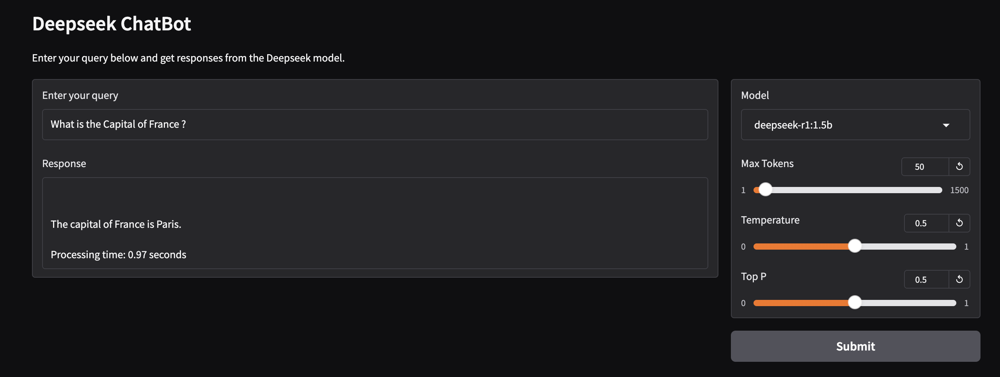

## Description

In this project, we utilize the Ollama to run the DeepSeek r1 model locally using Mac resources and Gradio to provide a chatbot interface. The entire setup is containerized using Docker, allowing for easy deployment and management of the application. By leveraging Docker Compose, we ensure that the environment remains consistent and isolated, making it straightforward to run the chatbot service locally where docker is installed.

## Prerequisites

1. **Docker**: Ensure you have Docker installed on your machine. You can download it from [here](https://www.docker.com/products/docker-desktop).

2. **Docker Compose**: Ensure you have Docker Compose installed. You can follow the installation instructions [here](https://docs.docker.com/compose/install/).

3. **Ollama Model**: Pull the Ollama model locally.

## Setup

1. **Clone the Repository**:
    ```sh
    git clone https://github.com/yourusername/deepseek.git
    cd deepseek
    ```

2. **Pull the Ollama Model**:
You can either pull the Ollama model from your local machine or exec into the container once the services are up. This is a one-time activity.
    ```sh
    ollama pull deepseek-r1:1.5b
    ollama run deepseek-r1:7b
    ```
## Running the Service

1. **Build and Start the Service**:
```sh
docker-compose up --build
```
*You might have to wait for some time till the Docker build and deepseek model loaded for the first time.*

2. **Access the Service**:
    Ollama : `http://localhost:11434`[Click here](http://localhost:11434)
    Gradio : `http://localhost:7860/` [Click here](http://localhost:7860/)


3. **Gradio Application for Chat Interface**: 
Navigate to the Gradio interface, update the model parameters, and ask for the response.


## Stopping the Service

1. **Stop the Containers**:
    ```sh
    docker-compose down
    ```

## Troubleshooting

- Ensure Docker and Docker Compose are correctly installed and running.
- Verify the Ollama model is correctly placed in the volume mount location.
- Check the Docker Compose logs for any errors:
    ```sh
    docker-compose logs
    ```

